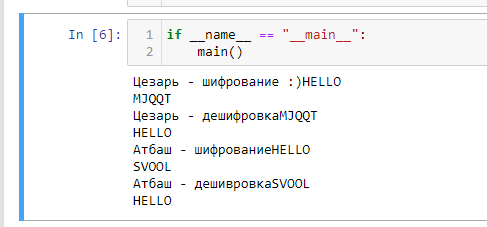

---
## Front matter
lang: ru-RU
title: Шифр простой замены
author: Хайдара Абдульджалиль Мухаммад Махди
institute: Российский Университет Дружбы Народов
date: 3 января, 2024, Москва, Россия

## Formatting
mainfont: PT Serif
romanfont: PT Serif
sansfont: PT Sans
monofont: PT Mono
toc: false
slide_level: 2
theme: metropolis
header-includes: 
 - \metroset{progressbar=frametitle,sectionpage=progressbar,numbering=fraction}
 - '\makeatletter'
 - '\beamer@ignorenonframefalse'
 - '\makeatother'
aspectratio: 43
section-titles: true

---

# Цели и задачи

## Цель лабораторной работы

Изучение алгоритмов шифрования Цезаря и Атбаш

# Выполнение лабораторной работы

## Шифрование

Шифрование – это такое преобразование исходного сообщения, которое не позволит всяким нехорошим людям прочитать данные, если они это сообщение перехватят. Делается это преобразование по специальным математическим и логическим алгоритмам.

## Шифр Атбаш

Атбаш — простой шифр подстановки.

Правило шифрования состоит в замене i-й буквы алфавита буквой с номером n − i + 1, где n — число букв в алфавите.

## Шифр Цезаря

Шифр Цезаря — это вид шифра подстановки, в котором каждый символ в открытом тексте заменяется символом находящимся на некотором постоянном числе позиций левее или правее него в алфавите. Например, в шифре со сдвигом 3 А была бы заменена на Г, Б станет Д, и так далее.

```
y = (x + k) mod n
x = (y - k + n) mod n
```

где
*x — символ открытого текста,
*y — символ шифрованного текста
*n — мощность алфавита
*k — ключ.

## Контрольный пример

{ #fig:001 width=70% height=70%}

# Выводы

## Результаты выполнения лабораторной работы

Изучили алгоритмы шифрования Цезаря и Атбаш.
